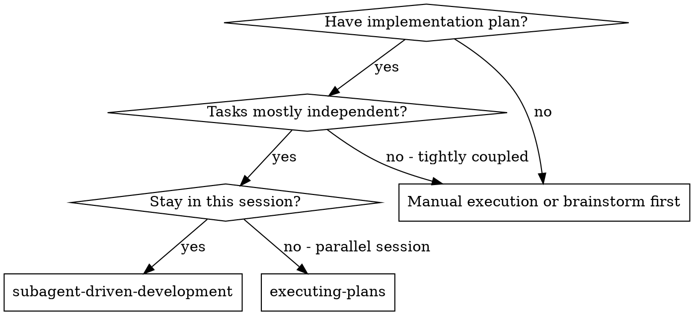
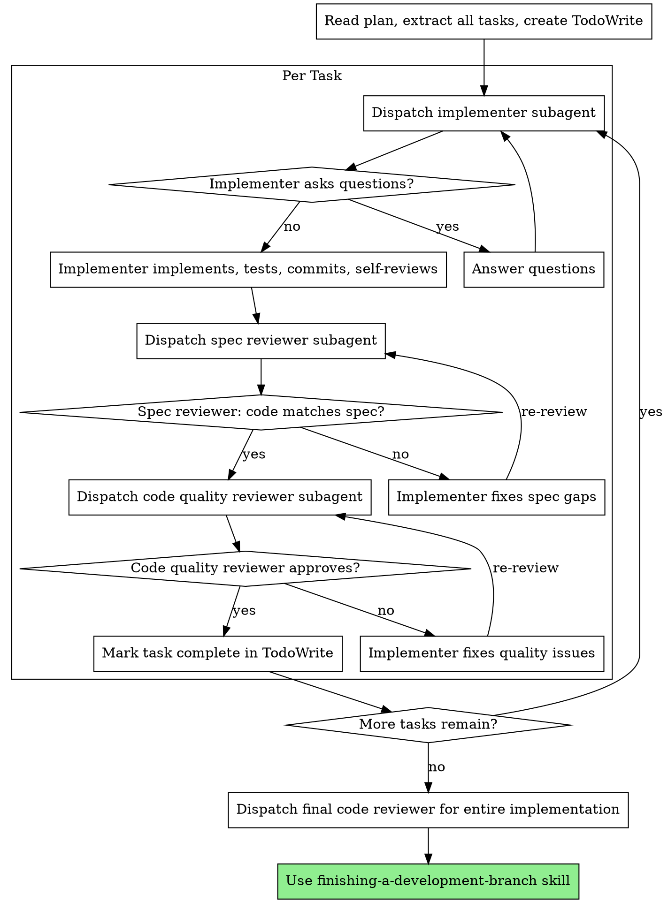

# Subagent-Driven Development

Execute plan by dispatching fresh subagent per task, with two-stage review after each: spec compliance review first, then code quality review.

**Why subagents:** Delegate tasks to specialized agents with isolated context. By precisely crafting their instructions, you ensure they stay focused. They should never inherit your session's context or history — you construct exactly what they need. This also preserves your own context for coordination work.

**Core principle:** Fresh subagent per task + two-stage review (spec then quality) = high quality, fast iteration

**Continuous execution:** Do not pause to check in with your human partner between tasks. Execute all tasks from the plan without stopping. The only reasons to stop are: BLOCKED status you cannot resolve, ambiguity that genuinely prevents progress, or all tasks complete.

## When to Use

## The Process

## Model Selection

Use the least powerful model that can handle each role:

- **Mechanical tasks** (isolated functions, clear specs, 1-2 files): cheap/fast model
- **Integration tasks** (multi-file coordination, pattern matching): standard model
- **Architecture/review tasks**: most capable model

## Handling Implementer Status

**DONE:** Proceed to spec compliance review.

**DONE_WITH_CONCERNS:** Read concerns before proceeding. If about correctness/scope, address first.

**NEEDS_CONTEXT:** Provide missing context and re-dispatch.

**BLOCKED:** Assess the blocker:
1. Context problem → provide more context, re-dispatch
2. Needs more reasoning → re-dispatch with more capable model
3. Task too large → break into smaller pieces
4. Plan is wrong → escalate to the human

## Implementer Prompt Template

Brief the implementer subagent with:
- Full task text (extracted from plan — never make them read the plan file)
- Scene-setting context: which codebase, what's been built so far, where this task fits
- TDD requirement: write failing test first, then implement
- Self-review requirement before reporting done
- Report status: DONE / DONE_WITH_CONCERNS / NEEDS_CONTEXT / BLOCKED

## Reviewer Prompt Templates

**Spec reviewer:** Given the task spec and git diff, does the implementation cover everything in the spec with nothing extra? Report: ✅ compliant or ❌ with specific gaps/extras.

**Code quality reviewer:** Review code quality against standards. Use `requesting-code-review` skill's template for full checklist. Report: ✅ approved or issues (Critical / Important / Minor).

## Red Flags

**Never:**
- Start implementation on main/master branch without explicit user consent
- Skip reviews (spec compliance OR code quality)
- Proceed with unfixed issues
- Dispatch multiple implementation subagents in parallel (conflicts)
- Make subagent read plan file (provide full text instead)
- Skip scene-setting context
- Accept "close enough" on spec compliance
- **Start code quality review before spec compliance is ✅** (wrong order)
- Move to next task while either review has open issues

## Integration

- **using-git-worktrees** — ensures isolated workspace
- **writing-plans** — creates the plan this skill executes
- **requesting-code-review** — code review template for reviewer subagents
- **finishing-a-development-branch** — complete development after all tasks
